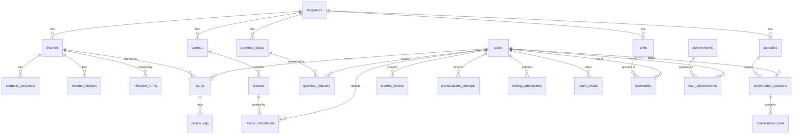

# Data Model

All tables use SQLAlchemy 2.0 typed mappings (`app/models/`). JSON columns
hold per-entity flexible structures (inflection tables, lesson blocks,
dialogue scripts) — natively supported by both SQLite and PostgreSQL.

## ER overview

## Content (per language)

| Table | Purpose | Notable columns |
|---|---|---|
| `languages` | supported target languages | `metadata_json` (alphabet, phonology) |
| `lexemes` | dictionary entries | stress/IPA/translit, CEFR, frequency rank, register, domain, `topic`, `difficulty`, `etymology`, morphology (`inflections`, `aspect`, `government`), mnemonics, `audio` refs |
| `texts` | graded library texts | sentence-aligned `{ru, en, audio_url}` transcript structure, kind, CEFR, word count |
| `example_sentences` | per-lexeme examples with stress marks | `audio_url` |
| `lexeme_relations` | synonyms/antonyms/family/collocations/false friends | `relation_type`, `target_lemma` |
| `grammar_topics` | grammar encyclopedia nodes | `content` (markdown sections), `drills` (auto-graded), `prerequisites` |
| `courses` / `lessons` | structured paths | `blocks` (typed activity list incl. answer keys), `new_lemmas`, `mastery_threshold` |
| `scenarios` | conversation roleplay settings | `script` (offline dialogue tree), `persona_prompt` (LLM) |
| `achievements` | gamification catalog | `metric`, `threshold` |

## Learner state (per user)

| Table | Purpose |
|---|---|
| `users` | account, CEFR estimate, XP, streak, `ui_immersion_ratio`, preferences |
| `cards` | SRS memory items: `stability`, `difficulty`, `state`, `due_at`, reps/lapses |
| `review_logs` | immutable review history (rating, elapsed, predicted retention, stability before/after) |
| `grammar_mastery` | per-topic EMA mastery + attempt history |
| `lesson_completions` | every mastery-test attempt with score and answers |
| `conversation_sessions` / `conversation_turns` | full dialogue history; `memory` JSON carries difficulty/weaknesses across sessions |
| `learning_events` | append-only event stream (type, skill, payload, duration) |
| `pronunciation_attempts` | scores + per-word feedback (audio in object storage) |
| `writing_submissions` | prompts, texts, corrections, quality scores |
| `user_achievements` | earned badges |
| `bookmarks` | reading position per user+text |

Daily-quest claims live under `users.preferences["quests_claimed"]`
(today-only record; quests are recomputed from `learning_events`).

## Design rules

1. **Content vs state separation** — content tables are read-mostly and
   shared; learner state references content by FK. Bulk content updates
   never touch user data.
2. **Idempotent seeding** — `app/seed/runner.py` inserts only missing rows
   (keyed by lemma/slug), so it runs safely on every startup and after
   content-pack upgrades.
3. **JSON where shapes vary** — a Russian verb's conjugation and a noun's
   declension are different shapes; forcing them into columns would either
   explode the schema or lose information. Query-relevant fields (CEFR,
   POS, frequency, register, domain) are real indexed columns.
4. **Append-only history** — `review_logs`, `learning_events`,
   `lesson_completions` are never updated, enabling later re-fitting of the
   memory model per user and full analytics replay.
